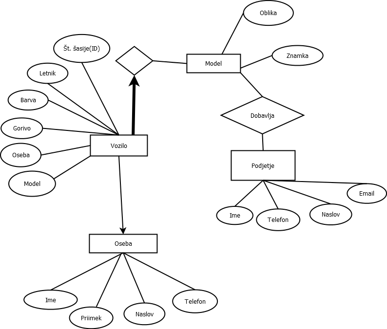

# Evidenca avtomobilov

 Avtorja:
 * Katja Bukovec
 * Žiga Herič

Seminarska naloga pri predmetu *Podatkovne baze 1*

## Opis
V bazi bodo zbrani podatki o vozilih, podatkih o vozilih, njihovih lastnikih in podjetjih, ki ta vozila dobavljajo. Končni izdelek bo spletna storitev, kjer bo uporabnik lahko: 

* Pogledal, katera vozila razvrščena po letih so v evidenci.
* Pogledal, katera vozila določene znamke so v evidenci.

## ER Diagram

