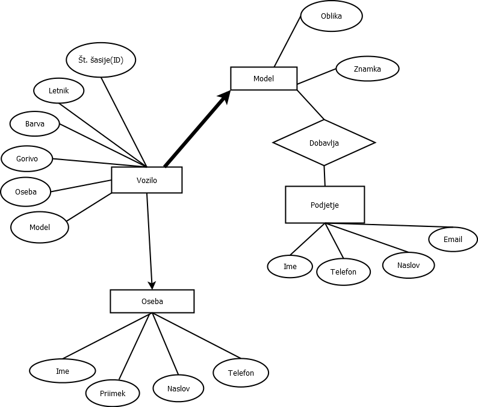

## Evidenca avtomobilov

 Avtorja:
 * Katja Bukovec
 * Žiga Herič

Seminarska naloga pri predmetu *Podatkovne baze 1*

# Opis
V bazi bodo zbrani podatki o vozilih, podatkih o vozilih, njihovih lastnikih in podjetjih, ki ta vozila dobavljajo. Končni izdelek bo spletna storitev, kjer bo uporabnik lahko: 

* Pogledal, katere znamke vozil dobavlja določeno podjetje.
* Pogledal podatke o vozilu z določeno številko šasije.
* Pogledal, koliko vozil z danim gorivom je na voljo.

# ER Diagram

